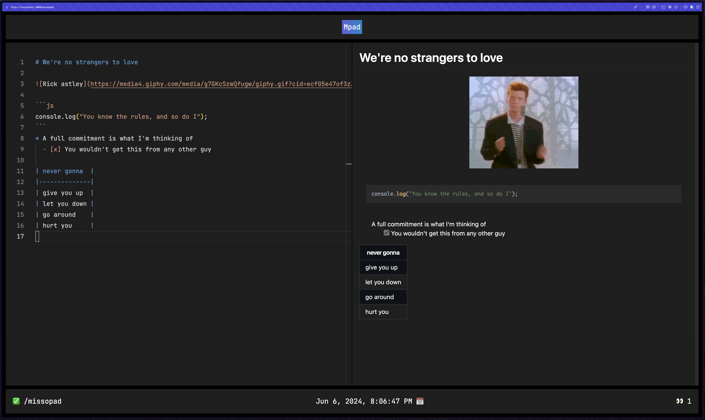

<p align="center">
    
    <p align="center">
        Share and update documents in real-time
    </p>
</p>

<br>

<p align="center">
    
</p>

Missopad is a real-time collaborative tool that renders Markdown. You can access any page without the need to authenticate in any way. Simply access a url (e.g https://missopad.com/<any_url>) and start editing!

## Development

Want to contribute to Missopad's signaling server? Simply follow the steps and you should be good to go. Just make sure you have [Bun](https://bun.sh/docs/installation) installed.

### Installing the local deps

Clone the project and run:

```sh
bun install
```

### Creating the env file:

Create a `.env` file at the root directory with the following contents:

```sh
PORT=4000
```

### Run the signaling server:

```sh
bun run src/index.ts
```

And you're good to go!
